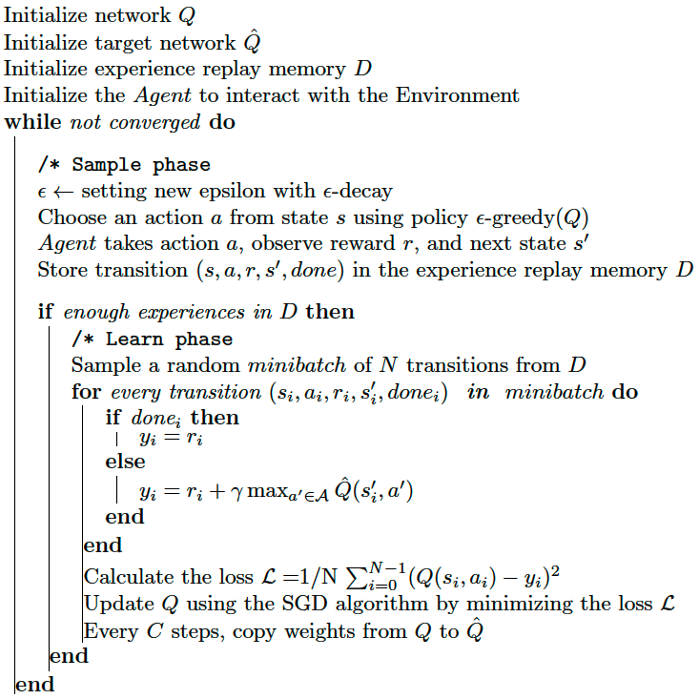
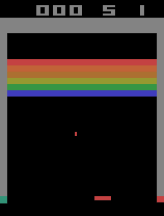

# DeepRL-Breakout-Atari
 This project was created by my teammates and I using Deep Reinforcement Learning to train Deep Q Network agent to play the atari breakout game and learn from interacting with the environment as rewards is assigned to each action. 

 ## Methodology
 - Deep Q-learning and Deep Q Networks
 - Markov Decision Process
 - Epsilon Greedy Strategy 
 - Exploitation vs exploration
 
  
## Usage
- Tensorflow was used to train the agent
- Install the necessary packages as seen in the code
- Open and run the code in a jupyter notebook and you should get something as seen below


## Author team
- Jovan Yap
- Ekkanat Tanchavalit
- Kantaphat Leelakunwet

## Citations

```bibtex
@misc{GiannisMitr,
    title   = {dqn_atari_breakout},
    author  = {},
    year    = {2021}, 
    source = {https://colab.research.google.com/github/GiannisMitr/DQN-Atari-Breakout/blob/master/dqn_atari_breakout.ipynb},
    github  = {https://github.com/GiannisMitr/DQN-Atari-Breakout}
}
```

```bibtex
@misc{jeffheaton,
    title   = {t81_558_class_12_04_atari},
    author  = {Jeff Heaton},
    year    = {2021},
    source = {https://colab.research.google.com/github/jeffheaton/t81_558_deep_learning/blob/master/t81_558_class_12_04_atari.ipynb},
    github  = {https://github.com/jeffheaton/t81_558_deep_learning}
}
```